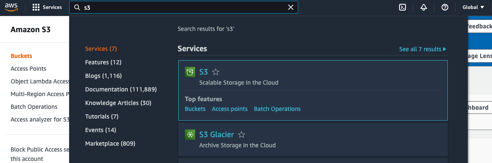
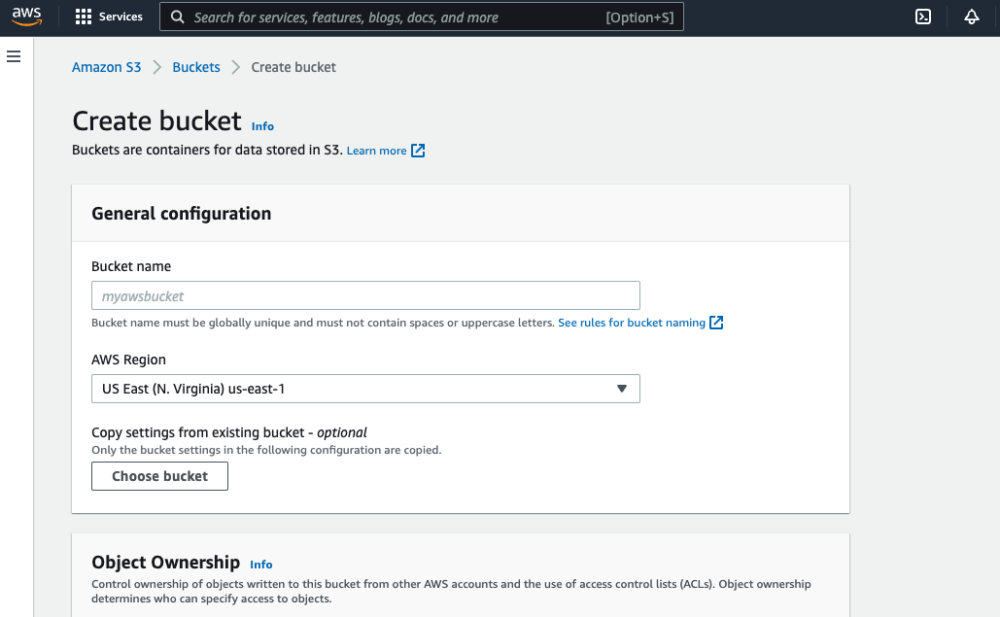
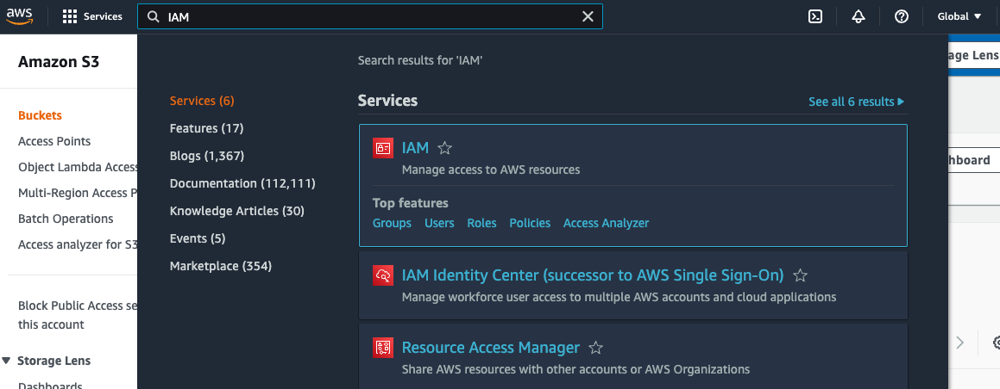
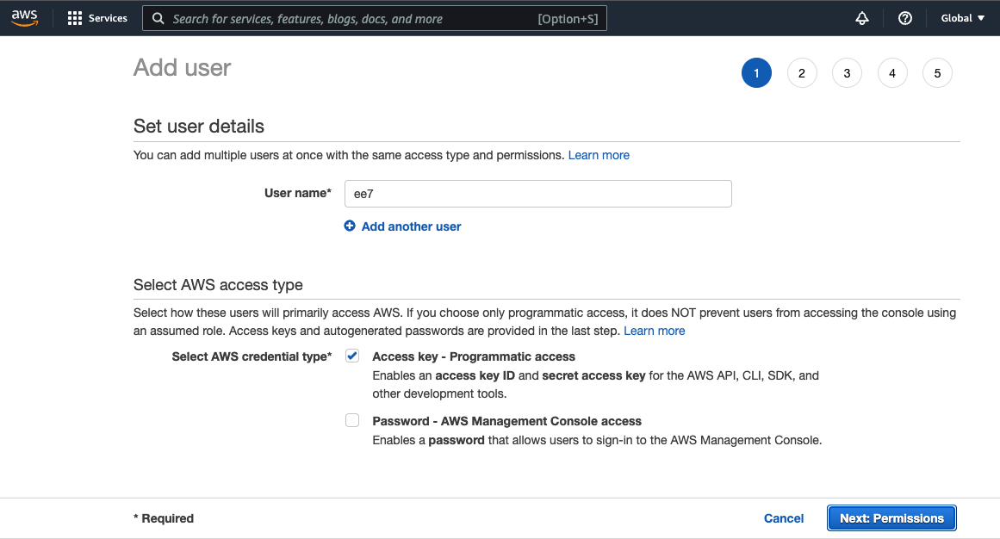
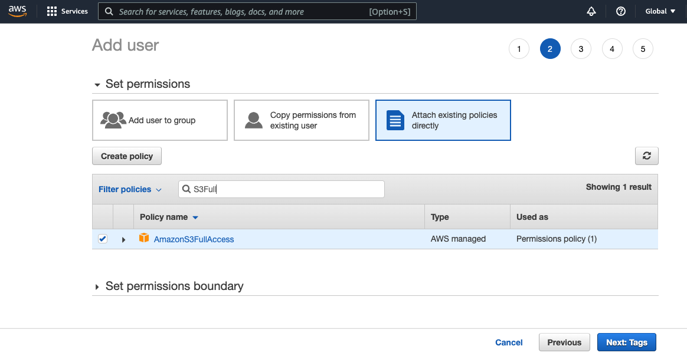
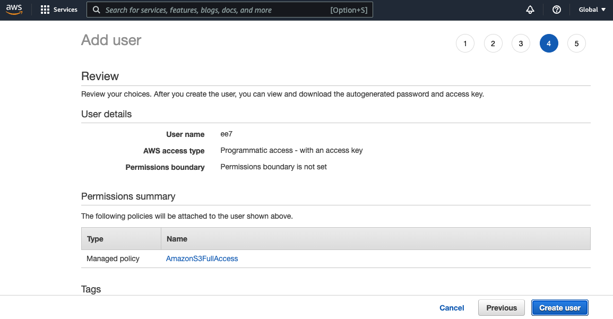
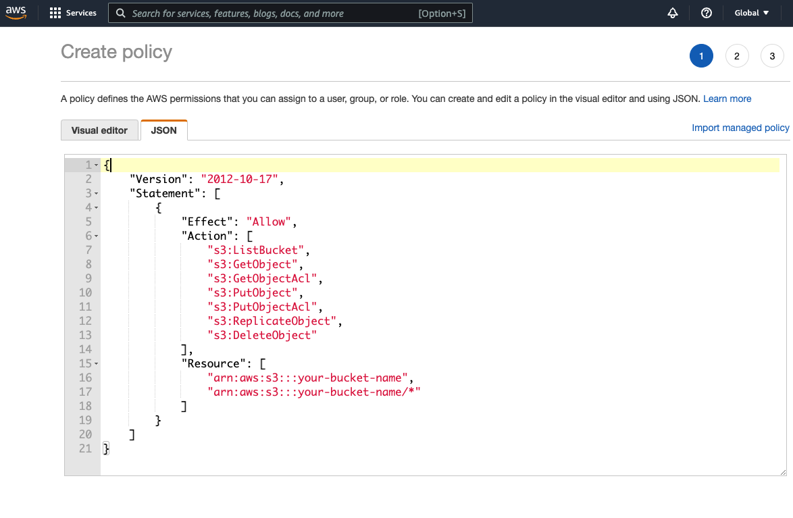
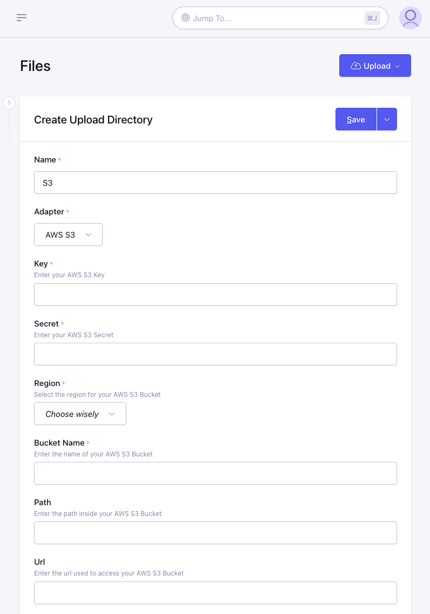

# Amazon S3 Adapter

## Step 1: Create an S3 Bucket

1. Go to Amazon Web Service Console and Login.
1. Search for "S3" in the top search bar and click the first result

1. Click on "Create Bucket" button and populate the form with your desired settings. Make a note of the bucket `name` and `region` because you will need these later when configuring ExpressionEngine


## Step 2: Create an IAM User with Full S3 Access

1. Search for "IAM" in the top search bar and click the first result

1. In the side navigation bar under "Access Management" click "Users"
1. On the Users page there is a button to "Add Users", click this
1. Enter the User Name and select "Programmatic access" for the access type. Then click "Next" at the bottom of the page.

1. Select "Attach Existing Policy Directly" and type "S3Full" in the search bar and check the box next to "AmazonS3FullAccess" and then click "Next"

1. Tags are optional so you can skip this page and click "Next"
1. Review the details of your new account and click "Create User" button

1. Now you will see the new user and you will be able to copy "Access key ID" and "Secret access key" credentials which will be necessary for configuring ExpressionEngine

## Step 2a: Create an IAM User with Restricted Access
1. Follow items 1-4 from Step 2 above
2. Click "Create Policy".  This should open a new window, do not close the old one, we will come back to that. Select the "JSON" tab and paste in the following content.  Make sure you substitue `your-bucket-name` with the name of your bucket created in Step 1.
```
{
    "Version": "2012-10-17",
    "Statement": [
        {
            "Effect": "Allow",
            "Action": [
                "s3:ListBucket",
                "s3:GetObject",
                "s3:GetObjectAcl",
                "s3:PutObject",
                "s3:PutObjectAcl",
                "s3:ReplicateObject",
                "s3:DeleteObject"
            ],
            "Resource": [
                "arn:aws:s3:::your-bucket-name",
                "arn:aws:s3:::your-bucket-name/*"
            ],
            "Condition": {
                "StringEquals": {
                    "s3:x-amz-acl": "bucket-owner-full-control"
                }
            }
        }
    ]
}
```

3. Tags are optional so you can skip this page and click "Next"
4. Give the policy a name like "{your-bucket-name}-access"
5. Click "Create Policy"
6. Go back to the old IAM User window and hit the refresh icon above the policies list
7. Type the name of your new policy in the search bar and check the box next to your new policy name and then click "Next"
8. You can now return to Step 2.6 and finish setting up your user

## Step 3: Configure ExpressionEngine

1. [Create a new Upload Directory](https://docs.expressionengine.com/v7/control-panel/file-manager/upload-directories.html#createedit-upload-directory)
2. Enter a name and choose "AWS S3" for the **Adapter**
3. Enter the "Access key ID" from Step 2.8 into the **Key** field
4. Enter the "Secret access key" from Step 2.8 into the **Secret** field
5. Choose the correct *Region* for this bucket selected during Step 1.3
6. Enter the **Bucket Name** which was chosen during Step 1.3
7. Optionally you can specify a **Path** inside your bucket where the directory should store files and folders.
8. Optionally you can specify a **Url** to use as the base when generating links to files in the bucket.  This can be useful for having a CDN handle requests to your files.
9. Continue to configure the directory how you normally would and click "Save".


