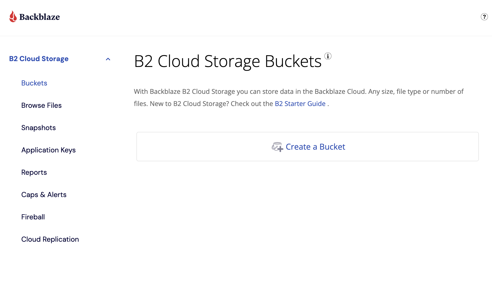
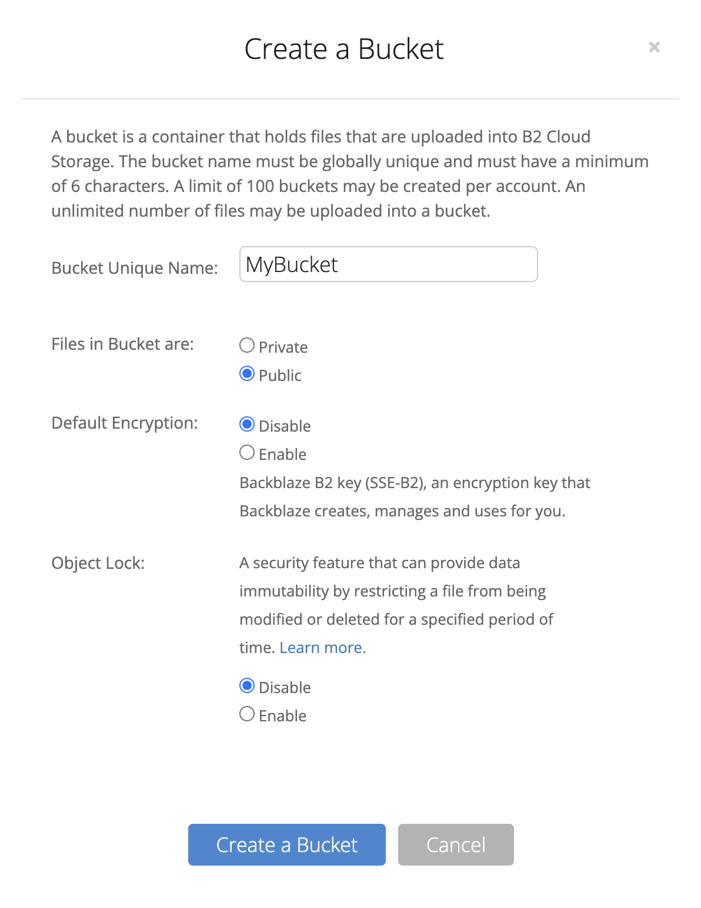
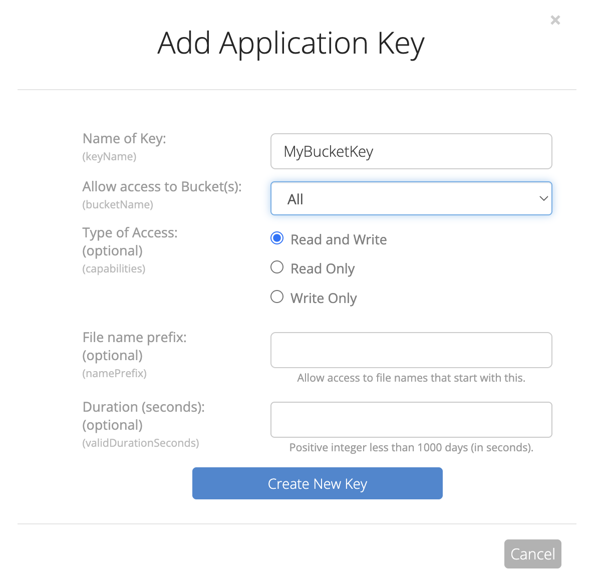
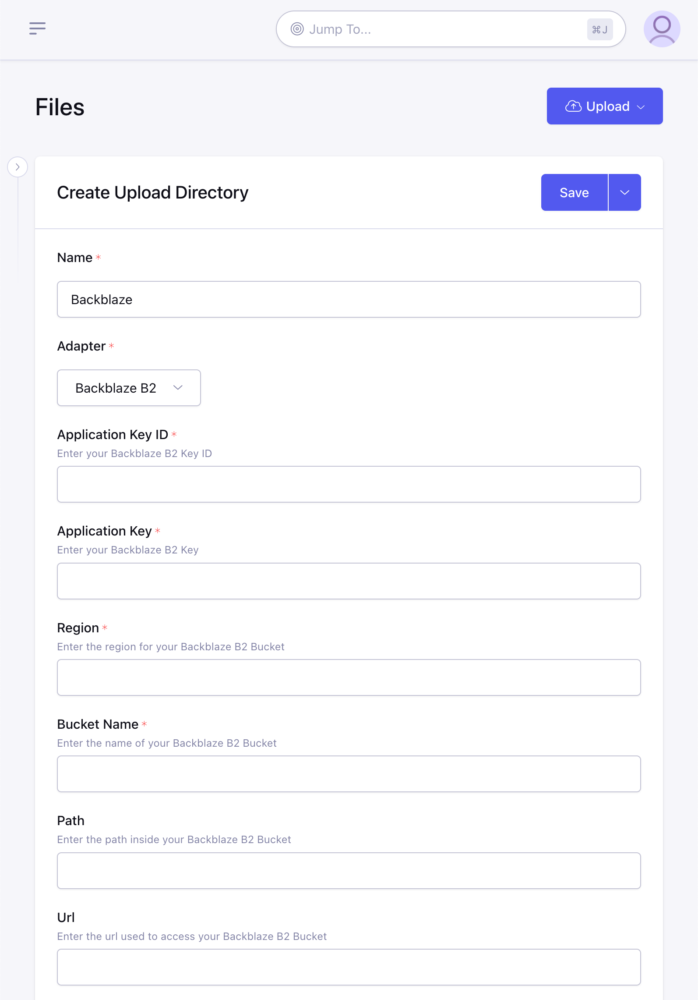

# Backblaze B2 Adapter

## Step 1: Create a B2 Bucket

1. Log in to the Backblaze account.
2. Select Create bucket.

3. Enter a name for the bucket
4. Make sure "Files in Bucket are:" is toggled to "Public"

5. Click Create a Bucket.
6. Take note of the "Endpoint" and the region which is encoded like this `s3.{region}.backblazeb2.com`.  Your region might look something like this: `us-east-001`

## Step 2: Create an Application Key

1. Under B2 Cloud Storage click "Application Keys" in the sidebar.
2. Now click "Add a New Application Key"
3. Give this token a name to help you remember what it is used for and make sure to assign "Read and Write" permissions.  You may also wish to restrict this key to the bucket you created in Step 1.

4. Now you will see the credentials and be able to copy the "Key ID" and "Key" which will be necessary for configuring ExpressionEngine

## Step 3: Configure ExpressionEngine

1. [Create a new Upload Directory](https://docs.expressionengine.com/v7/control-panel/file-manager/upload-directories.html#createedit-upload-directory)
2. Enter a name and choose "Backblaze B2" for the **Adapter**
3. Enter the "Application Key ID" from Step 2.4 into the **Key** field
4. Enter the "Application Key" from Step 2.4 into the **Secret** field
5. Enter the **Region** given to your bucket in Step 1.6
6. Enter the **Bucket Name** which was chosen during Step 1.3
7. Optionally you can specify a **Path** inside your bucket where the directory should store files and folders. Please note this path is only used for file storage and manipulation, you may need to add this path to your **Url** as well depending on your configuration.
8. Optionally you can specify a **Url** to use as the base when generating links to files in the bucket.  This can be useful for having a CDN handle requests to your files.  (Cloud Files will auto-generate a "path-style" url from your bucket configuration but if you need or prefer a "virtual-hosted style" url you can enter that instead)
9. Continue to configure the directory how you normally would and click "Save".

