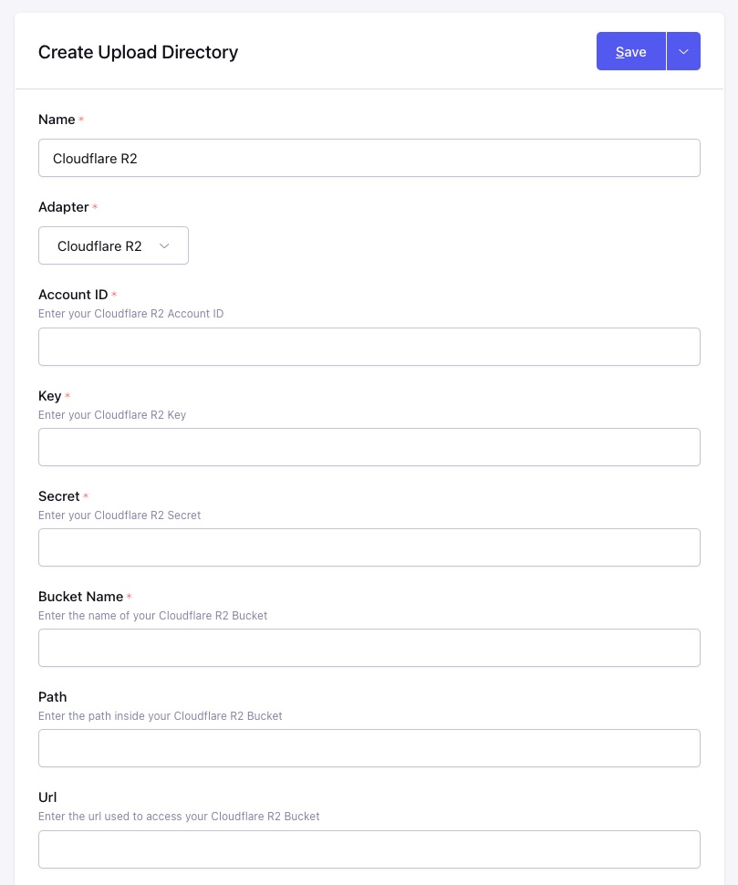

# Cloudflare R2 Adapter

## Step 1: Create an R2 Bucket

1. Log in to the Cloudflare dashboard and select R2.
2. Select Create bucket.

3. Enter a name for the bucket and select Create bucket.

## Step 2: Create an API Token

1. On the R2 - Overview page click "Manage R2 API Tokens" in the sidebar.  You should also make note of your Account ID in this sidebar.  It will be required later when setting up the ExpressionEngine upload directory.

2. Now click "Create API Token"
3. Give this token a name to help you remember what it is used for and make sure to assign "Edit" permissions along with a TTL to determine the lifespan of this token.

4. Now you will see the credentials and be able to copy the "Key" and the "Secret" which will be necessary for configuring ExpressionEngine

## Step 3: Configure ExpressionEngine

1. [Create a new Upload Directory](https://docs.expressionengine.com/v7/control-panel/file-manager/upload-directories.html#createedit-upload-directory)
2. Enter a name and choose "Cloudflare R2" for the **Adapter**
3. Enter the "Account ID" from Step 2.1 into the **Account ID** field
4. Enter the "Token Key" from Step 2.4 into the **Key** field
5. Enter the "Token Secret" from Step 2.4 into the **Secret** field
6. Enter the **Bucket Name** which was chosen during Step 1.3
7. Optionally you can specify a **Path** inside your bucket where the directory should store files and folders.
8. Specify a **Url** to use as the base when generating links to files in the bucket.  This is a required field because it is the only way to setup public access to files within your bucket.  You can either use a custom domain or the `r2.dev` service for development and testing.  You can learn more about these options in the [Cloudflare R2 Public Buckets documentation](https://developers.cloudflare.com/r2/buckets/public-buckets/).
9. Continue to configure the directory how you normally would and click "Save".

