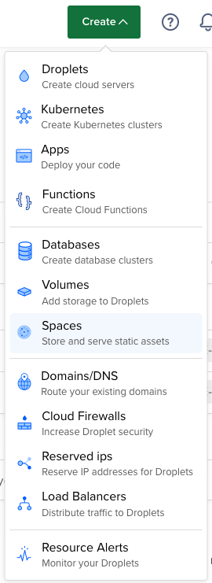
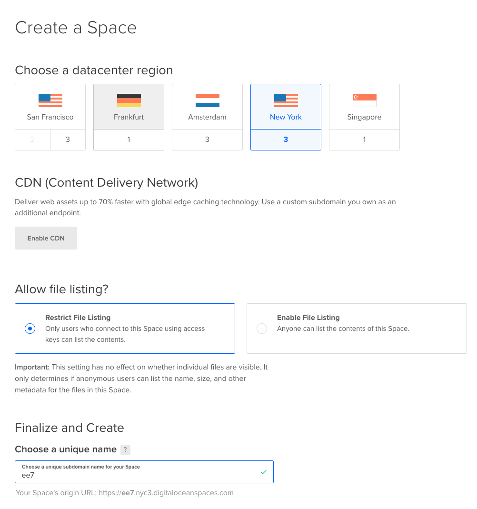
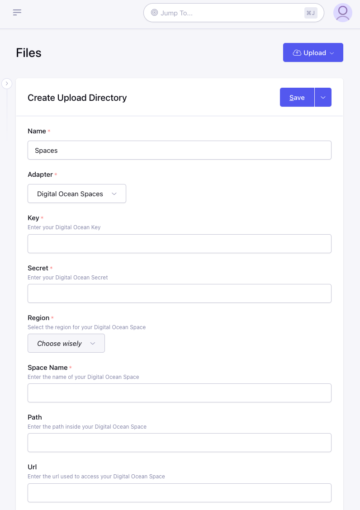

# DigitalOcean Spaces

## Step 1: Create a new Space

1. Login to your DigitalOcean account
1. Click the "Create" button in the header and choose "Spaces"

1. Populate this form with your desired settings. Make a note of the Space's `name` and `region` because you will need these later when configuring ExpressionEngine

## Step 2: Create an API User

1. In the side navigation click "Manage - Spaces"
1. Now above the listing of Spaces click the button to "Manage Keys"
1. Under "Spaces access keys" click "Generate New Key"
1. Give this key a name to help you remember what it is used for and click the checkmark button to create the key.
1. Now you will see the credentials and be able to copy the "Key" (on top) and the "Secret" (on bottom) which will be necessary for configuring ExpressionEngine

## Step 3: Configure ExpressionEngine

1. [Create a new Upload Directory](https://docs.expressionengine.com/v7/control-panel/file-manager/upload-directories.html#createedit-upload-directory)
2. Enter a name and choose "DigitalOcean Spaces" for the **Adapter**
3. Enter the "Key" from Step 2.5 into the **Key** field
4. Enter the "Secret" from Step 2.5 into the **Secret** field
5. Choose the correct *Region* for this space selected during Step 1.3
6. Enter the **Space Name** which was chosen during Step 1.3
7. Optionally you can specify a **Path** inside your space where the directory should store files and folders.
8. Optionally you can specify a **Url** to use as the base when generating links to files in the space.  This can be useful for having a CDN handle requests to your files.
9. Continue to configure the directory how you normally would and click "Save".

